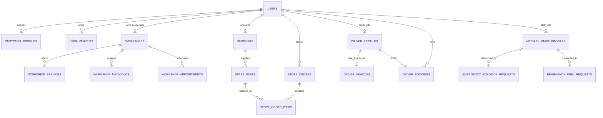

# 🗄️ Mechify Relational Database Specification & Documentation

Welcome to the **Mechify** Database Documentation. The database is written for **MySQL 8.0+ / MariaDB 10.4+** and is fully compatible with **XAMPP / phpMyAdmin**.

---

## 🎯 Supported Platform User Roles

The database supports all 6 distinct platform roles:

| Role Name | Table / Entity | Capabilities & Restrictions |
|---|---|---|
| **1. Basic User** (`basic_user`) | `users` + `customer_profiles` + `user_vehicles` | Customer requesting emergency roadside SOS, fuel delivery, workshop appointments, booking drivers, or buying auto parts. Has personal garage vehicles. |
| **2. Workshop Owner** (`workshop_owner`) | `users` + `workshops` + `workshop_services` + `workshop_mechanics` | Manages physical auto repair hubs, registers workshop services & pricing, employs mechanics, and manages workshop appointments. |
| **3. Parts Supplier** (`parts_supplier`) | `users` + `suppliers` + `spare_parts` | Sells aftermarket and OEM parts through the Mechify Parts Store, tracks inventory, SKUs, wholesale/retail pricing, and receives supplier orders. |
| **4. Driver Without Car** (`driver_without_car`) | `users` + `driver_profiles` | Professional personal chauffeur hired to drive the customer's personal vehicle. Holds BRTA Class-A license, transmission proficiencies, hourly/daily hiring rates. |
| **5. Driver With Car** (`driver_with_car`) | `users` + `driver_profiles` + `driver_vehicles` | Driver who owns or operates a dedicated vehicle (Luxury SUV, Sedan, Van) available for rides and executive chauffeurs. |
| **6. Mechify Company Staff** (`mechify_staff`) | `users` + `mechify_staff_profiles` | **EXCLUSIVE ROLE**: Mechify company personnel strictly providing **Emergency Roadside Assistance** and **Emergency Fuel Delivery**. Assigned emergency patrol vans, mobile fuel tankers, and live GPS tracking. |

---

## 🏗️ Entity Relationship Architecture (ERD)



---

## 📋 Table Dictionary

### 1. `users` (Master Authentication & User Accounts)
- `id`: INT UNSIGNED AUTO_INCREMENT PRIMARY KEY
- `role`: ENUM (`'basic_user'`, `'workshop_owner'`, `'parts_supplier'`, `'driver_without_car'`, `'driver_with_car'`, `'mechify_staff'`, `'admin'`)
- `email`: VARCHAR(191) UNIQUE NOT NULL
- `password_hash`: VARCHAR(255) NOT NULL
- `first_name`, `last_name`: VARCHAR(100) NOT NULL
- `phone`: VARCHAR(25) NULL
- `avatar_url`: VARCHAR(255) NULL
- `is_verified`: TINYINT(1) DEFAULT 0
- `status`: ENUM (`'active'`, `'suspended'`, `'pending_approval'`) DEFAULT `'active'`
- `created_at`, `updated_at`: TIMESTAMP

### 2. `customer_profiles` & `user_vehicles` (Basic User)
- **`customer_profiles`**: Linked 1:1 with `users.id`. Stores NID number, emergency contacts, preferred payment method (`bKash`, `Nagad`, `Visa`, `MasterCard`, `Cash`), and home address.
- **`user_vehicles`**: The customer's garage of vehicles (`Sedan`, `SUV`, `Supercar/Exotic`, `Microbus`, `Hatchback`, `Motorcycle`), license plate, fuel type (`Octane`, `Petrol`, `Diesel`, `Hybrid`, `Electric`, `CNG/LPG`), and default vehicle indicator.

### 3. `workshops`, `workshop_services`, `workshop_mechanics`, `workshop_appointments` (Workshop Owner)
- **`workshops`**: Linked 1:1 to `users.id` (where role is `workshop_owner`). Stores workshop name, trade license, zone (`Gulshan/Banani`, `Dhanmondi`, `Uttara`, etc.), GPS latitude/longitude, contact phones, operating hours, 24/7 indicator, rating, and verification status.
- **`workshop_services`**: List of services (`Engine Diagnostics`, `Brake Overhaul`, `AC Repair`, `Laser Wheel Alignment`, `Computerized Scan`), price, and estimated duration.
- **`workshop_mechanics`**: Mechanics working under the workshop (e.g. Master Engine Technician), experience years, contact, on-duty status.
- **`workshop_appointments`**: Complete tracking for all incoming customer service requests:
  - **`emergency_roadside`**: Critical roadside breakdowns, tire blown, dead battery, urgent dispatch.
  - **`emergency_home`**: Doorstep emergency mechanic home dispatches (locked brakes, no-crank at residence).
  - **`workshop_bay`**: Standard scheduled workshop appointments with assigned bays, diagnostic bays, and maintenance.
  - Fields: `booking_type`, `urgency_level`, `car_model`, `car_reg_number`, `dispatch_address`, `appointment_date`, `appointment_time`, `customer_notes`, `status`, `total_cost`, `payment_method`, `payment_status`.

### 4. `suppliers`, `spare_parts`, `store_orders`, `store_order_items` (Parts Supplier & Store)
- **`suppliers`**: Supplier company entity, BIN/tax license, warehouse location, contact person, payout method.
- **`spare_parts`**: Catalog items supplied to the store. Includes category (`Engine Parts`, `Brake Components`, `Tyres`, `Filters`, `Suspension`, `Exhaust & Turbo`), SKU, brand, OEM number, wholesale cost price, retail price, discount %, stock quantity, min reorder level, warranty, and image.
- **`store_orders`** & **`store_order_items`**: Manages part purchases, shipping details, total amounts, bKash/Card payments, and delivery tracking.

### 5. `driver_profiles`, `driver_vehicles`, `driver_bookings` (Drivers)
- **`driver_profiles`**: Driver credentials. Distinguishes `driver_type`:
  - `'without_car'`: Professional Chauffeur driving client's vehicle.
  - `'with_car'`: Driver with dedicated car for rides/rentals.
  - Holds BRTA Class-A license, NID, transmission proficiencies (`Manual & Automatic`, `All Transmissions + EV Dual Motor`), hourly and daily hiring rates, rating, and police clearance status.
- **`driver_vehicles`**: Attached 1:1 with `driver_profiles` for `driver_with_car`. Details car model (e.g. Prado TX-L, Mercedes E-Class AMG), car type, license plate, seats, luggage, daily/hourly rates, luxury amenities, fitness cert expiry, and insurance.
- **`driver_bookings`**: Customer bookings for chauffeurs or rides (pickup location, destination, duration, start datetime, fare, status).

### 6. `mechify_staff_profiles`, `emergency_roadside_requests`, `emergency_fuel_requests` (Company Staff)
- **`mechify_staff_profiles`**: Staff credentials dedicated exclusively to emergency road response. Holds employee badge ID, authorized service (`'roadside_assistance'`, `'fuel_delivery'`, `'both_emergency_services'`), duty zone, emergency patrol vehicle (e.g. *Mechify Rapid Patrol Van #01*, *Mobile Fuel Dispenser Unit #03*), on-board emergency equipment, duty status, and live GPS coordinates.
- **`emergency_roadside_requests`**: 24/7 SOS incidents (e.g. *Dead Battery / Jumpstart*, *Flat Tire*, *Engine Overheat*, *Towing*), GPS pin, assigned emergency staff, live status (`sos_broadcasted`, `patrol_en_route`, `on_scene_diagnosing`, `resolved_completed`), and dispatch timestamps.
- **`emergency_fuel_requests`**: Roadside emergency fuel delivery (Octane 95 RON, Petrol, Diesel, Mobile EV charge), liters requested, unit price, delivery fee, GPS pin, assigned staff tanker unit, and delivery status.

---

## 🚀 How to Import into XAMPP / phpMyAdmin

### Option A: Via phpMyAdmin Web UI
1. Open your browser and navigate to: `http://localhost/phpmyadmin/`
2. Click on the **Import** tab at the top.
3. Click **Choose File** and select:
   `/Applications/XAMPP/xamppfiles/htdocs/mechify/mechify_db.sql`
4. Click **Go** at the bottom right.
5. The `mechify_db` database and all 16 tables with seed data will be created!

### Option B: Via Terminal / Command Line
```bash
/Applications/XAMPP/xamppfiles/bin/mysql -u root -p < /Applications/XAMPP/xamppfiles/htdocs/mechify/mechify_db.sql
```
*(If no password is set on your local XAMPP MySQL, just press Enter when prompted)*

---

## 🔍 Useful SQL Queries for Development

### 1. View all users by role:
```sql
SELECT id, role, CONCAT(first_name, ' ', last_name) AS full_name, email, phone, status 
FROM users 
ORDER BY role, id;
```

### 2. View available Mechify Emergency Staff on duty:
```sql
SELECT 
    s.id, 
    CONCAT(u.first_name, ' ', u.last_name) AS staff_name,
    s.badge_id, 
    s.authorized_service, 
    s.emergency_vehicle_assigned, 
    s.duty_zone, 
    s.duty_status,
    s.direct_dispatch_phone
FROM mechify_staff_profiles s
JOIN users u ON s.staff_user_id = u.id
WHERE s.duty_status = 'available';
```

### 3. View all active Emergency Roadside SOS requests:
```sql
SELECT 
    r.id AS sos_id,
    r.customer_name,
    r.customer_phone,
    r.vehicle_model,
    r.breakdown_issue,
    r.urgency_level,
    r.location_address,
    r.status,
    CONCAT(su.first_name, ' ', su.last_name) AS assigned_staff,
    sp.emergency_vehicle_assigned
FROM emergency_roadside_requests r
LEFT JOIN mechify_staff_profiles sp ON r.assigned_staff_id = sp.id
LEFT JOIN users su ON sp.staff_user_id = su.id;
```

### 4. View all Drivers With Car vs Drivers Without Car:
```sql
SELECT 
    dp.id,
    CONCAT(u.first_name, ' ', u.last_name) AS driver_name,
    dp.driver_type,
    dp.license_number,
    dp.hourly_rate,
    dp.daily_rate,
    dp.rating,
    dv.car_model,
    dv.car_type,
    dv.license_plate
FROM driver_profiles dp
JOIN users u ON dp.driver_user_id = u.id
LEFT JOIN driver_vehicles dv ON dv.driver_id = dp.id;
```

### 5. View Spare Parts Catalog with Supplier Information:
```sql
SELECT 
    p.sku,
    p.name AS part_name,
    p.category,
    p.brand,
    p.retail_selling_price,
    p.stock_quantity,
    s.company_name AS supplier_name,
    s.contact_person
FROM spare_parts p
JOIN suppliers s ON p.supplier_id = s.id
WHERE p.is_active = 1;
```
